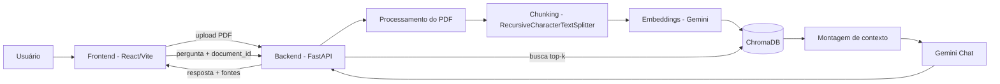

# TalkDoc

Aplicação web que permite enviar um documento PDF e conversar com o seu conteúdo através de RAG (Retrieval-Augmented Generation). As respostas são fundamentadas exclusivamente no documento enviado, com indicação das páginas utilizadas como fonte.

## Sobre o projeto

O usuário envia um PDF, que é processado (extração de texto, chunking, geração de embeddings e indexação vetorial). Depois disso, é possível fazer perguntas sobre o conteúdo do documento através de um chat, recebendo respostas fundamentadas no texto original, junto com as páginas que sustentam cada resposta.

## Arquitetura



Cada documento enviado gera uma coleção própria no ChromaDB (identificada pelo `document_id`), o que garante isolamento entre documentos diferentes sem necessidade de filtro manual por metadado — a busca de um documento nunca enxerga embeddings de outro.

## Stack utilizada

**Backend**
- FastAPI (API REST)
- LangChain + `langchain-google-genai` (orquestração do RAG)
- Google Gemini (chat e embeddings)
- ChromaDB (vector store)
- PyMuPDF (extração de texto do PDF, com metadado de página)
- Pydantic Settings (configuração)

**Frontend**
- React + Vite
- Axios (comunicação com a API)

**Infraestrutura**
- Docker + Docker Compose

## Estrutura do projeto

```
.
├── app/                      # Backend
│   ├── core/
│   │   ├── config.py          # Configurações centralizadas (pydantic-settings)
│   │   └── llms.py             # Instâncias do modelo de chat/embeddings e prompt do RAG
│   ├── routers/
│   │   ├── documents.py        # Endpoint de upload/processamento
│   │   └── chat.py              # Endpoint de pergunta
│   ├── services/
│   │   ├── vectorize.py         # Processamento de PDF, chunking, embeddings
│   │   └── rag.py                # Pipeline de pergunta/resposta (retrieval + geração)
│   ├── schemas/
│   │   └── chat.py               # Modelos Pydantic de request/response
│   ├── storage/
│   │   ├── uploads/               # PDFs enviados (não versionado)
│   │   └── chroma_db/              # Índice vetorial persistido (não versionado)
│   ├── main.py
│   ├── requirements.txt
│   ├── Dockerfile
│   └── .env.example
│
├── frontend/                 # Frontend
│   ├── src/
│   │   ├── components/
│   │   │   ├── DocumentUpload.jsx  # Upload + estado de processamento
│   │   │   ├── UploadForm.jsx
│   │   │   ├── ChatWindow.jsx       # Histórico de mensagens + estado do chat
│   │   │   ├── QuestionForm.jsx
│   │   │   └── MessageBubble.jsx     # Renderização de mensagem + fontes
│   │   ├── api.js                     # Instância do axios
│   │   └── App.jsx                     # Estado compartilhado (document_id)
│   ├── Dockerfile
│   └── .env.example
│
└── docker-compose.yml
```

## Como executar

### Com Docker (recomendado)

Pré-requisitos: Docker Desktop instalado e em execução.

1. Clone o repositório
2. Configure as variáveis de ambiente do backend:
   ```bash
   cd app
   cp .env.example keys.env
   ```
   Edite `app/keys.env` e adicione sua chave da API do Google Gemini:
   ```
   GEMINI_API_KEY=sua_chave_aqui
   ```
3. Na raiz do projeto, suba os containers:
   ```bash
   docker compose up --build
   ```
4. Acesse `http://localhost:5173`

O frontend já vem configurado para se comunicar com o backend em `http://localhost:8000` (definido em tempo de build via `docker-compose.yml`).

### Localmente, sem Docker (desenvolvimento)

**Backend**
```bash
cd app
python -m venv venv
venv\Scripts\activate       # Windows
pip install -r requirements.txt
cp .env.example keys.env    # e preencher GEMINI_API_KEY
uvicorn main:app --reload --port 8000
```

**Frontend**
```bash
cd frontend
cp .env.example .env        # e preencher VITE_API_URL=http://localhost:8000
npm install
npm run dev
```

## Variáveis de ambiente

**`app/keys.env`** (não versionado — copiar de `app/.env.example`)

| Variável | Descrição | Obrigatória |
|---|---|---|
| `GEMINI_API_KEY` | Chave da API do Google Gemini | Sim |
| `CHAT_MODEL` | Modelo de chat usado | Não (default: `gemini-3.5-flash`) |
| `EMBEDDING_MODEL` | Modelo de embeddings usado | Não (default: `models/gemini-embedding-001`) |
| `CORS_ORIGINS` | Origens permitidas pelo CORS | Não (default: `http://localhost:5173`) |

**`frontend/.env`** (apenas para execução local sem Docker)

| Variável | Descrição |
|---|---|
| `VITE_API_URL` | URL base da API backend |

Ao rodar via Docker, `VITE_API_URL` é definido diretamente no `docker-compose.yml` (build arg), já que o Vite embute essa variável no bundle em tempo de build.

## Endpoints da API

| Método | Rota | Descrição |
|---|---|---|
| `POST` | `/documents/upload` | Recebe um PDF, extrai o texto, gera chunks e embeddings, indexa no ChromaDB. Retorna `document_id`. |
| `POST` | `/chat` | Recebe `document_id` e `question`. Retorna `answer` (resposta fundamentada) e `sources` (páginas utilizadas). |

Documentação interativa disponível em `http://localhost:8000/docs` (Swagger).

## Decisões técnicas e tradeoffs

- **Isolamento por coleção, não por filtro de metadado**: cada documento gera uma coleção própria no ChromaDB, nomeada pelo `document_id`.
- **Chunking com sobreposição**: `chunk_size=500` e `chunk_overlap=100`, valores escolhidos como equilíbrio entre precisão da busca (chunks menores) e preservação de contexto entre trechos adjacentes.
- **Top-k fixo em 3**: número de chunks recuperados por pergunta, configurável via `core/config.py`. Não foi implementado ajuste dinâmico por tamanho de documento.
- **Processamento síncrono no upload**: a extração, chunking e geração de embeddings acontecem dentro da mesma requisição HTTP do upload. Simplifica a implementação, mas significa que o usuário aguarda uma única requisição mais longa em vez de acompanhar etapas separadas de "enviando" e "processando".
- **Prompt com instrução explícita de não alucinar**: o template força o modelo a declarar quando a resposta não está no contexto fornecido, em vez de inferir ou complementar com conhecimento externo.

## Limitações conhecidas

- Reenviar o mesmo arquivo PDF gera um novo `document_id` e reprocessa tudo do zero — não há deduplicação por hash de conteúdo.
- Não há autenticação ou separação de usuários; qualquer pessoa com acesso à API pode consultar qualquer `document_id` existente.
- O upload não oferece feedback granular de progresso (é um único estado de carregamento até o processamento terminar).
- Não há testes automatizados no projeto.
- `VITE_API_URL` está fixado como `http://localhost:8000` no `docker-compose.yml`, o que funciona para execução local, mas exigiria ajuste manual para outros ambientes (ex.: deploy).

